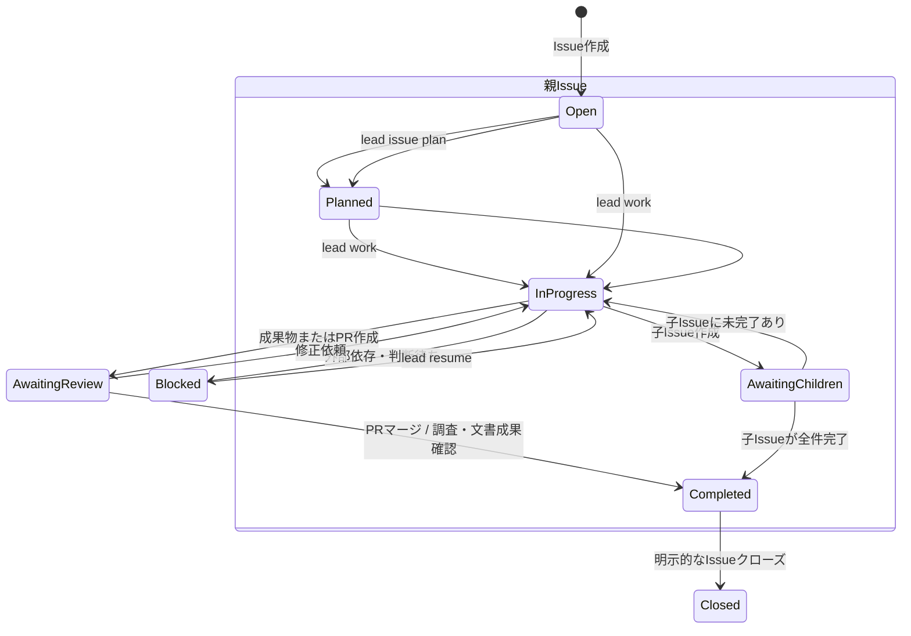

# RFC: ワークフロー柔軟性の設計（Issue・Branch・PRのライフサイクル管理）

- **Issue**: [#25](https://github.com/kuwa72/lead-cli/issues/25)
- **親トラッキングIssue**: [#29](https://github.com/kuwa72/lead-cli/issues/29)
- **前提**: [#16 提供形態・配布方式・基本UXモデル](rfc-16-product-ux.md)
- **ステータス**: Proposal / RFC
- **更新日**: 2026-09-06

---

## 1. 結論

`lead` の標準フローは維持しつつ、Issue の作業目的と Branch / PR の関係を明示的に選べるようにする。

| 方針 | 決定 |
| :--- | :--- |
| GitHub上のIssue・PR | GitHubの状態を正とする。`lead` は状態を推定・補助する |
| ローカル状態 | `$XDG_STATE_HOME/lead/workflows.json` に作業とWorktreeの対応を保存する |
| 標準モード | `implement`: 1 Issue → 1 Branch → 1 PR |
| 分割モード | `split`: 親Issueを残し、子IssueごとにBranch / PRを作る |
| 調査・文書モード | `research` / `docs`: PRを必須にせず、成果をIssueコメントまたは成果物で報告する |
| 既存作業の再開 | `lead resume` で既存Branch・Worktree・PRを再接続する |
| 自動マージ | `auto` / `confirm` / `never` を設定可能。調査・文書モードの既定値は `never` |
| Issueクローズ | 完了条件を満たした場合だけ実行し、モードごとに既定動作を変える |

このRFCでは、実装そのものではなく、状態モデル・コマンド・プロンプトの仕様を定める。

---

## 2. 解決する問題

現行の1本化されたフローは、次の運用を表現できない。

- 大きなIssueを複数のPRに分け、親Issueを最後まで開いたままにする
- 調査結果や設計書だけをIssueに報告し、PRを作らずに完了する
- 既存Branch、Worktree、PRを引き継いで作業を再開する
- 1つのIssueに複数の作業単位が紐づいた状態を確認する
- 曖昧な大福帳Issueを、エージェントが1回で走りきれる粒度に分解する

#16で定めた「Issue選択 → Human-in-the-loop → エージェント作業 → CI監視」というUXは変えない。変えるのは、着手後に必ず1つのPRを作ってIssueを閉じるという暗黙の前提である。

---

## 3. ワークフローのモード

### 3.1 `implement`: 実装（標準）

通常の機能追加・修正に使う。原則として1 Issueに1つの作業Branchと1つのPRを対応させる。

完了条件は次のすべてを満たすこと。

1. TDDを含む受入条件を満たす
2. PRを作成する
3. CIが成功する
4. 設定されたマージポリシーに従ってマージする
5. マージ結果を確認する
6. Issueをクローズする、またはクローズ可能な状態として明示する

### 3.2 `split`: 分割実装

大きな親Issueを複数の子Issueへ分解し、子Issueごとに独立した作業を進める。

- 親Issueは、子Issueがすべて完了するまで自動クローズしない
- 子Issueは通常の `implement` と同じライフサイクルを持つ
- 親Issue本文に子Issueと進捗を追記する
- 子Issueには親Issueへの参照を含める
- 子Issueの自動作成はプレビュー後の明示操作に限定する

GitHubのSub-issues機能に依存せず、Issue本文・コメントの相互参照で最低限の互換性を確保する。Sub-issues APIを利用できる環境では、将来アダプタとして追加できる。

1つのIssueから直接複数PRを作る必要がある場合は、例外的に `--part <slug>` を付けて作業単位を識別する。この場合も、各PRの本文に元Issueと作業単位を記録する。通常は `split` による子Issue化を推奨する。

### 3.3 `research`: 調査

コード変更を目的としない調査に使う。

- Branch・PRの作成は任意
- 既定ではエージェントに調査結果をIssueコメントとして投稿させる
- CI待機、マージ、自動クローズは行わない
- 完了時は調査結果のコメントURLまたはローカル成果物を状態記録に保存する
- Issueクローズは `--close` を明示した場合だけ行う

### 3.4 `docs`: 文書作成

RFC、設計書、ガイドなど、成果物が文書である作業に使う。既存リポジトリのレビュー手順に従う必要がある場合はPRを作るが、IssueからPR作成を必須にはしない。

- 文書をリポジトリに追加・変更する場合: Branch / PRを作る
- Issueコメントだけで成果を報告する場合: PRは作らない
- 既定の自動マージは `never`
- Issueクローズはレビュー完了後に明示操作で行う

---

## 4. Issue・Branch・Worktree・PRの状態モデル

### 4.1 状態遷移図



上図の状態は、GitHubの状態を置き換えるものではない。`lead` が表示する論理状態であり、次の情報から決定する。

- GitHub Issueのopen / closed
- 関連PRの状態（open / merged / closed）
- ローカル状態ファイルのモード、成果物、最後の操作
- 子Issueの完了状況

### 4.2 モード別の完了条件

| モード | 成果物 | PR | マージ | Issueクローズの既定 |
| :--- | :--- | :---: | :---: | :---: |
| `implement` | コードとテスト | 必須 | 設定に従う | マージ確認後に実行 |
| `split`（親） | 子Issue一覧と進捗 | 不要 | 不要 | 全子Issue完了後 |
| `split`（子） | コードとテスト | 必須 | 設定に従う | マージ確認後に実行 |
| `research` | Issueコメントまたは調査成果物 | 任意 | なし | `--close` 指定時のみ |
| `docs`（PRあり） | 文書 | 必須 | 既定は手動確認 | レビュー完了後 |
| `docs`（PRなし） | Issueコメントまたは文書 | 不要 | なし | `--close` 指定時のみ |

`lead` は成果物を確認できない状態で「完了」と表示してはならない。調査コメントの投稿失敗、PRの未マージ、子Issueの未完了がある場合は `blocked` または `awaiting_review` と表示する。

---

## 5. 状態の永続化

### 5.1 GitHubとローカルの責務

GitHubを一次情報、ローカル状態を作業接続情報として扱う。

| 情報 | 一次情報 | ローカルに保存する内容 |
| :--- | :--- | :--- |
| Issueのopen / closed | GitHub Issue | 最終取得時刻と表示用キャッシュ |
| PRのopen / merged / closed | GitHub PR | PR番号と最終取得時刻 |
| Branchの存在 | Gitリポジトリ | Branch名 |
| Worktreeの場所 | GitのWorktree情報 | Worktreeパス |
| 作業モード | `lead` の操作 | `implement` / `split` / `research` / `docs` |
| 完了成果 | Issueコメント・PR・ファイル | コメントURL、PR番号、成果物パス |
| マージ方針 | CLI・設定・Issue単位の指定 | 解決後の実効値 |

### 5.2 状態ファイル

保存先は次の優先順位で決定する。

1. `LEAD_STATE_FILE`
2. `$XDG_STATE_HOME/lead/workflows.json`
3. `~/.local/state/lead/workflows.json`

リポジトリ内には保存しない。複数Worktreeから同じリポジトリの状態を参照でき、作業用リポジトリを汚さないためである。ファイルには認証情報やIssue本文全文を保存しない。

1レコードの最小構造は次のとおり。

```json
{
  "repository": "owner/name",
  "issue": 25,
  "parent_issue": null,
  "mode": "implement",
  "branch": "issue/25-workflow-flexibility",
  "worktree": "/path/to/worktree",
  "pull_requests": [
    {
      "number": 42,
      "part": null,
      "status": "open"
    }
  ],
  "status": "awaiting_review",
  "merge_policy": "confirm",
  "artifacts": [],
  "updated_at": "2026-09-06T00:00:00Z"
}
```

書き込みは一時ファイルへの出力後にrenameする。壊れたJSONは既存状態を上書きせず、読み取り時には警告してGitHub・Gitの情報から再構成を試みる。

### 5.3 `status` の表示

`lead status` は、ローカル状態だけを表示せず、GitHubとGitの最新状態を取得して次を示す。

```text
Issue #25  implement  awaiting_review
Branch: issue/25-workflow-flexibility  Worktree: /path/to/worktree
PR: #42  OPEN  CI: passing  Merge policy: confirm
Next: review and run `lead finish 25 --merge`
```

状態が不整合の場合は、推測で修復せず、候補を表示して `lead resume --repair` の明示操作を要求する。

---

## 6. コマンド仕様案

### 6.1 作業開始

```text
lead work [<issue>] [flags]
```

Issueを選択し、モードに応じた作業コンテキストを作成する。Issue番号を省略した場合は#16で定めたTUIから選択する。

| Flag | 意味 |
| :--- | :--- |
| `--mode <implement\|split\|research\|docs>` | 作業モード。既定は `implement` |
| `--branch <name>` | 既存Branchを使用する。指定時は新規作成しない |
| `--pr <number>` | 既存PRに接続する。指定時は新規PRを作らない |
| `--worktree [<path>]` | Worktreeを作成または既存Worktreeへ接続する |
| `--part <slug>` | 1 Issue複数PRの作業単位を指定する |
| `--draft` | Draft PRとして作成する |
| `--merge-policy <auto\|confirm\|never>` | この作業のマージ方針を指定する |
| `--no-close` | マージ後もIssueを自動クローズしない |
| `--no-prompt` | 動的プロンプトを注入せず、素のエージェントシェルを起動する。既定ではHuman-in-the-loopを維持 |

`--branch` と `--pr` を指定した場合、対象が別Issueに紐づいていればエラーにする。既存作業を引き継ぐ意図が曖昧な場合に、別のBranchやPRを誤って作らないためである。

### 6.2 作業再開

```text
lead resume [<issue>|<branch>|<pr>] [flags]
```

次の順で対象を解決する。

1. 引数がPR番号ならPRからIssueとBranchを取得する
2. 引数がBranch名なら関連PRとIssueを取得する
3. 引数がIssue番号ならローカル状態、Issue本文、Branch、PRの順に候補を探す
4. 候補が複数ある場合は選択UIを表示し、自動選択しない

| Flag | 意味 |
| :--- | :--- |
| `--worktree <path>` | 接続するWorktreeを固定する |
| `--pr <number>` | 再開対象のPRを固定する |
| `--repair` | 不整合を確認したうえでローカル状態を再構成する |
| `--mode <...>` | 欠落しているモード情報を補う |

`resume` は新しいBranchやPRを作らない。新規作成が必要な場合は、再開を中止して `work` を実行する。

### 6.3 状態確認と完了処理

```text
lead status [<issue>] [--all] [--json]
lead finish <issue> [flags]
```

`finish` は作業モードごとに完了条件を確認する。`research` / `docs` でPRがない場合、成果物URLまたはパスを要求する。

| Flag | 意味 |
| :--- | :--- |
| `--merge` | CI成功後にマージする。設定に関係なくこの操作で明示する |
| `--close` | Issueをクローズする |
| `--no-close` | Issueをクローズしない |
| `--comment <text\|file>` | 完了報告コメントを投稿する |
| `--outcome <merged\|researched\|documented\|blocked>` | 完了結果を明示する |

`finish` によるマージ・クローズは、対象のPRまたは成果物を再確認してから行う。`--merge` と `--close` の同時指定でも、CI未成功や未完了の子Issueがあれば停止する。

### 6.4 Issueの計画・分解

```text
lead issue plan <issue> [flags]
lead issue split <issue> [flags]
```

`plan` は大きなIssueを分析し、子Issue候補と受入条件をプロンプトまたはMarkdownで出力する。GitHubを変更しない。

`split --apply` は、プレビューされた候補を確認した後に子Issueを作成する。

| Flag | 意味 |
| :--- | :--- |
| `--output <terminal\|file>` | 計画の出力先。既定はterminal |
| `--template <path>` | 分解ルール・プロジェクト規約を追加する |
| `--apply` | 確認後に子Issueを作成する |
| `--label <name>` | 作成する子Issueに付けるラベル |
| `--max-children <n>` | 子Issue数の上限 |

`--apply` なしではIssue、ラベル、コメントを変更しない。作成済み候補には親Issue番号を含め、重複実行時に既存候補を検出できるようにする。

---

## 7. マージとクローズのポリシー

### 7.1 マージポリシー

設定の優先順位は次のとおり。

1. コマンドラインフラグ
2. Issue単位の指定
3. リポジトリ設定
4. モード既定値

モード既定値は、`implement` / `split` の子Issueを `auto`、`docs` を `never`、`research` を `never` とする。`auto` はCI成功後にマージするが、GitHubの保護ルール、レビュー必須、コンフリクトを迂回しない。`confirm` はCI成功後に停止し、ユーザーが `finish --merge` を実行する。

Issue単位の指定は、Issue本文の機械判定に依存しない。`lead work --merge-policy` または明示的なリポジトリ設定を使用する。将来ラベルを使う場合も、値が不正なら安全側の `confirm` にフォールバックする。

### 7.2 クローズポリシー

- `implement` の既定: PRマージとIssueへの結果反映を確認した後にクローズ
- `split` の親Issue: 子Issueが全件完了するまでクローズしない
- `research` / `docs` のPRなし: `--close` がある場合だけクローズ
- `--no-close`: どのモードでもクローズを抑止
- クローズ済みIssueに対する `work`: 既定では警告して停止し、`--reopen` の明示を要求

自動クローズが失敗した場合、マージ済みの成果を未完了へ戻さない。Issueの状態とエラーを記録し、`lead finish --close` で再試行できるようにする。

---

## 8. エージェント向けIssue分解プロンプト

### 8.1 目的

`lead issue plan` が生成するプロンプトは、曖昧なIssueを、エージェントが1回の作業で完了できる子Issueへ分解するために使う。コードを書くプロンプトではなく、計画とIssue案を作るプロンプトである。

分解の単位は、テスト込みで数ファイルから千行程度を目安にする。ただし行数を機械的な上限にはせず、受入条件を独立して検証できることを優先する。

### 8.2 テンプレート

```text
あなたはGitHub Issueの分解担当です。

## 親Issue
- Repository: {{repository}}
- Number: #{{issue_number}}
- Title: {{issue_title}}
- Body:
{{issue_body}}

## リポジトリ規約
{{repository_rules}}

## 目的
親Issueを、エージェントがTDDで1回の作業として完了できる子Issueへ分解してください。

## 制約
1. 各子Issueは、目的・対象範囲・受入条件・検証方法が1つのまとまりになっていること。
2. 受入条件は実行結果、生成物、終了状態など検証可能な形で書くこと。
3. 実装Issueでは、最初に追加する失敗テスト（Red）を明記すること。
4. 調査・文書作成など、PRが不要な作業は明示すること。
5. 子Issue間の依存関係を示し、並列実行できるものとできないものを分けること。
6. 親Issueの要件を勝手に追加・削除しないこと。不明点は「要確認」として分離すること。
7. 1つの子Issueに複数の独立した目的を詰め込まないこと。

## 出力形式
各候補を次の形式で出力してください。

### 子Issue案: <具体的なタイトル>
- Mode: implement | research | docs
- Purpose: <このIssueで完了させること>
- Scope: <変更対象と対象外>
- Depends on: <子Issue番号またはnone>
- Parallelizable: yes | no
- Acceptance criteria:
  - <実行可能または成果物で検証できる条件>
- TDD first step: <最初に追加してRedを確認するテスト。該当しない場合は理由>
- Expected output: PR | Issue comment | document | none
- Open questions:
  - <判断が必要な点。なければnone>

最後に、分解漏れ、重複、親Issueに残すべき受入条件を列挙してください。
```

### 8.3 作成前の確認

`lead issue split --apply` は、次を表示してから確認を求める。

- 作成する子Issueのタイトルと数
- 親Issueとの関係
- 子IssueごとのモードとPR要否
- 依存関係
- 親Issueに残る受入条件

ユーザーが確認しない限り、Issue作成APIを呼び出さない。

---

## 9. 実装時の検証要件

このRFCを実装する際は、状態判定を文字列検索で検証しない。次の振る舞いをテストする。

- `work` がモードごとにBranch / Worktree / PR作成の有無を正しく選ぶ
- `resume` が既存Branch・PRを再利用し、新規作成を行わない
- `status` がGitHub、Git、状態ファイルの不整合を検出する
- `finish` がCI未成功、未完了の子Issue、成果物欠落時にマージ・クローズしない
- `issue split --apply` なしでは外部状態を変更しない
- `issue split --apply` が確認後にだけ子Issueを作る
- 状態ファイルの壊れた書き込みで既存データを失わない
- `gh` や `herdr` の呼び出しは、実際の引数・標準入出力・終了コードをダミーコマンドで検証する

---

## 10. 未決事項

実装着手前に次を確定する。

1. GitHubのSub-issues APIが利用可能な場合に、本文参照と併用するか
2. リポジトリ設定ファイルの正式な名前と配置（例: `.lead.yaml`）
3. `auto` の既定値を、保護ブランチやレビュー設定に応じて `confirm` へ自動変更するか
4. 状態ファイルの同時更新を、ファイルロックで防ぐか単一プロセス前提にするか
5. `lead issue plan` のエージェント実行を、現在のTUI起動フローに統合するか

これらは本RFCの状態モデルを変更しない。実装時の互換性と安全性を左右するため、#25の実装サブタスクで決定する。
