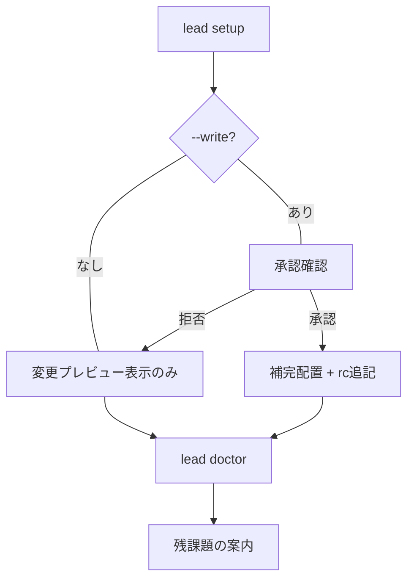

# RFC: 配布方式・インストーラー設計（パッケージング・シェル連携）

- **Issue**: [#26](https://github.com/kuwa72/lead-cli/issues/26)
- **親トラッキングIssue**: [#29](https://github.com/kuwa72/lead-cli/issues/29)
- **前提**: [#16 提供形態・配布方式・基本UXモデル](rfc-16-product-ux.md) / [#22 実装言語移行検討](rfc-22-language-migration.md)
- **ステータス**: Proposal / RFC
- **更新日**: 2026-09-06

---

## 1. 結論

| 方針 | 決定 |
| :--- | :--- |
| 提供形態 | Go 製の単一静的バイナリ `lead`（#16 で確定）。本 RFC はその配布詳細を定める |
| バイナリ名 | `lead` に統一（Issue #26 記載の `hgf` / `gh-hgf` は旧名。本 RFC で読み替える） |
| `gh extension` | **採用しない**（#16 §2.2 の決定を維持。薄いラッパーの後付けは将来の任意事項） |
| 配布の正本 | **GitHub Releases**（goreleaser によるクロスビルド）。Homebrew とインストールスクリプトは Releases を参照する二次経路 |
| 配布経路（3経路） | 1. GitHub Releases 直取得 / 2. Homebrew (`kuwa72/tap/lead`) / 3. インストールスクリプト (`install.sh`, `curl` + checksum 検証) |
| 対応 OS/Arch（初期） | `linux/amd64`, `linux/arm64`, `darwin/amd64`, `darwin/arm64`。Windows は対象外（Herdr 連携が UNIX 前提のため） |
| シェル連携 | `lead setup`（対話式導入）、`lead completion <shell>`（補完出力）、`lead doctor`（診断）。rc ファイルの自動書換えは確認なしに行わない |
| 対応シェル | `bash`, `zsh`, `fish`。補完は必須、キーバインド（例: Ctrl-G で `lead work` 起動）はオプトイン |
| アップデート | `lead update`（Releases 直取得ユーザ向けセルフアップデート）+ `brew upgrade`（Homebrew ユーザ向け）。バックグラウンド自動更新はしない |
| バージョニング | SemVer + git タグ `vX.Y.Z`。`lead version` / `lead --version` で表示 |

この RFC では実装そのものではなく、配布チャネル選定・リリースパイプライン・インストール〜シェル初期設定の UX フロー・検証要件を定める。

---

## 2. 背景とスコープ

### 2.1 前提の確定事項

- #16: スタンドアロン単体 CLI バイナリ `lead`。`gh extension` 不採用。配布は GitHub Releases / Homebrew / インストールスクリプト。Herdr 環境自動検出、組み込み TUI、Human-in-the-loop、左右マルチペイン。
- #22: 実装言語 Go。TUI は `koki-develop/go-fzf` 内包（外部 `fzf` 依存なし）。外部 CLI は `internal/ports`  dietro の Adapter パターン。`gh` 連携は `go-gh` 優先。

### 2.2 本 RFC のスコープ

- 配布チャネル選定と CI/CD リリースパイプライン設計。
- インストール〜シェル初期設定の UX フロー設計。
- アップデート・診断・アンインストールの仕様。

### 2.3 非目標（Non-goals）

- `gh extension` 用エントリポイント・リポジトリ構成（#16 §4.2 で設計対象外と明示）。
- `apt` / `yum` / `winget` 等の OS ネイティブパッケージ、Windows MSI、Docker イメージ（需要が出たら別 Issue）。
- バックグラウンドの自動更新デーモン、利用統計・テレメトリ収集。
- シェルプラグインマネージャ（sheldon / fisher 等）固有の配布。

### 2.4 名称の読み替え

Issue #26 の記載は旧名 `hgf` 前提のため、本 RFC では次の通り読み替える。

| Issue #26 の記載 | 本 RFC |
| :--- | :--- |
| `hgf` / `gh-hgf` | `lead` |
| `hgf setup` | `lead setup` |
| `hgf update` | `lead update` |
| `brew install kuwa72/tap/hgf` | `brew install kuwa72/tap/lead` |
| `gh extension install ...` | 不採用（§3.1 参照） |

---

## 3. 配布チャネル選定

### 3.1 `gh extension` を採用しない（再確認）

#16 §2.2 の決定を本 RFC でも維持する。要点のみ再掲する。

1. `lead` の責務は GitHub 操作ではなくオーケストレーションであり、`gh` は 1 アダプタに過ぎない。
2. リリース方針・バージョニングを `lead` 側で独立に制御したい。
3. `gh` 非依存の実行パス（Herdr 連携・素のエージェント起動）を確保したい。
4. 需要が生じたら薄いラッパーの後付けは可能。逆方向の剥がしは難しい。

したがって `gh extension install` / `gh extension update` は提供しない。

### 3.2 選定：3経路と役割分担

| 経路 | 位置づけ | 対象ユーザ | 更新手段 |
| :--- | :--- | :--- | :--- |
| **GitHub Releases**（正本） | 成果物の正本。チェックサム・リリースノートの一次情報 | CI、エアギャップ、手動導入 | `lead update` または再ダウンロード |
| **Homebrew tap**（`kuwa72/tap/lead`） | macOS / Linux の常用経路 | 日常利用者 | `brew upgrade` |
| **インストールスクリプト**（`install.sh`） | Releases の薄いラッパー。依存ゼロ導入 | ワンライナー導入したい利用者 | `lead update`（スクリプト自体に更新機能は持たせない） |

3経路はいずれも同じ goreleaser 成果物を指す。tap とスクリプトは独自ビルドを持たず、Releases のアセット URL と sha256 を参照するだけにする。配布物の二重管理を避けるためである。

`curl -fsSL ... | bash` 型は便利さと危険性の両方を持つため、**無検証のパイプ実行は推奨しない**。後述 §5 の通り、スクリプトは checksum 検証を必須とし、`--version` ピン留めと `--help` の事前確認を可能にする。

---

## 4. リリースパイプライン設計

### 4.1 正本：GitHub Releases + goreleaser

- トリガ：`vX.Y.Z` タグ push。
- ツール：`goreleaser release --clean`（GoReleaser v2 系）。
- ビルド対象：`./cmd/lead`。CGO 無効（`CGO_ENABLED=0`）の静的バイナリ。
- 初期マトリクス：`linux/amd64`, `linux/arm64`, `darwin/amd64`, `darwin/arm64`。
- 成果物：OS/Arch 別 tar.gz（バイナリ + `LICENSE` + 補完スクリプト + `README` 抜粋）、`checksums.txt`（sha256）、リリースノート（タグ間の PR 一覧を自動生成し、破壊的変更があれば手で追記）。

goreleaser 設定の骨子（詳細は実装時に確定する。ファイル名は `.goreleaser.yaml` を想定）。

```yaml
# .goreleaser.yaml（骨子）
version: 2
project_name: lead
builds:
  - id: lead
    main: ./cmd/lead
    binary: lead
    env: [CGO_ENABLED=0]
    goos: [linux, darwin]
    goarch: [amd64, arm64]
archives:
  - name_template: "{{ .ProjectName }}_{{ .Version }}_{{ .Os }}_{{ .Arch }}"
    format_overrides:
      - goos: linux
        format: tar.gz
      - goos: darwin
        format: tar.gz
    files:
      - LICENSE*
      - completions/*
checksum:
  name_template: checksums.txt
  algorithm: sha256
brews:
  - name: lead
    tap:
      owner: kuwa72
      name: homebrew-tap
    homepage: https://github.com/kuwa72/lead-cli
    description: Issue-driven TDD workflow CLI with multi-agent orchestration
    directory: Formula
release:
  draft: false
  prerelease: auto
```

### 4.2 GitHub Actions 構成案

既存 CI（`.github/workflows/ci.yml`：`test/run-tests.sh`）とは別に `release.yml` を追加する。

```text
.github/workflows/
  ci.yml       # 既存：main push / PR で test/run-tests.sh（変更なし）
  release.yml  # 新規：v* タグ push 時のみ goreleaser 実行
```

`release.yml` の責務は最小にする。

1. `actions/checkout`（`fetch-depth: 0` でタグ取得）。
2. `actions/setup-go`（`go.mod` の Go バージョンに追従）。
3. `goreleaser/goreleaser-action` で `release --clean`。
4. Homebrew tap 更新は goreleaser の `brews` に委譲し、ワークフロー側で tap リポジトリを直接触らない。

権限は `contents: write` のみに絞る。Homebrew tap への push には tap 側で受け入れ可能な PAT または Deploy Key を使い、`GITHUB_TOKEN` の権限拡大で代用しない。

### 4.3 Homebrew tap 設計

- tap リポジトリ：`kuwa72/homebrew-tap`（`Formula/lead.rb`）。
- Formula は goreleaser の `brews` が自動生成・更新する。手編集の Formula を別途維持しない。
- Formula のテストブロックは `lead version` と `lead doctor --offline` 程度に留め、ネットワーク依存のテストは書かない。
- 導入コマンド：`brew install kuwa72/tap/lead`。将来的に core への移行は考えない（tap 維持で十分）。

Brew 経由の更新は `brew upgrade kuwa72/tap/lead` が正規経路である。Brew 版バイナリで `lead update` を実行した場合は、バイナリを置換せず「`brew upgrade` を使ってください」と案内して終了する（§7 参照）。

### 4.4 バージョニングとリリース運用

- SemVer を採用。タグは `vX.Y.Z`（例: `v0.1.0`）。バイナリ名・Formula 名にバージョンを含めない。
- `lead version` は `version`（タグ）、`commit`（短縮 SHA）、`date`（UTC）、`built_by`（goreleaser）を表示する。`go build -ldflags -X` 注入を想定。
- リリース種別：通常リリースは手動タグ打ち。`auto` プレリリース判定は goreleaser の `prerelease: auto` に任せる（`-rc`, `-beta` を含むタグは自動でプレリリース扱い）。
- 破壊的変更（設定ファイル形式・コマンド体系の変更）はリリースノートの先頭に `BREAKING` として明記し、移行手順を `lead doctor` の検出対象に加える。

---

## 5. インストールスクリプト設計

### 5.1 位置づけとセキュリティ方針

- `install.sh` は Releases アセットの取得・検証・配置を行う薄いラッパーである。独自のビルド・変換を行わない。
- 取得は HTTPS のみ。`curl -fsSL`（`curl` がなければ `wget -qO-` にフォールバック）。
- **sha256 検証を必須**とする。`checksums.txt` を取得し、該当アセットのハッシュを検証してから展開する。検証失敗時は配置せず非ゼロ終了する。
- `curl -fsSL <url> | bash` の無検証実行を README の主経路にしない。推奨手順は「スクリプト取得 → 中身確認 → `--help` → 実行」とする。

### 5.2 インターフェース案

```text
install.sh [--version <vX.Y.Z|latest>] [--prefix <dir>] [--no-modify-path] [--help]
```

| Flag | 既定 | 意味 |
| :--- | :--- | :--- |
| `--version` | `latest` | 導入版。`latest` は Releases の最新安定版を解決する。CI ではバージョン固定を推奨 |
| `--prefix` | `/usr/local`（書込不可なら `~/.local` にフォールバック） | バイナリ配置先（`<prefix>/bin/lead`） |
| `--no-modify-path` | - | `PATH` 案内・rc 追記提案を抑止する（CI・非対話用） |
| `--help` | - | 使い方を表示して終了する |

OS/Arch 判定は `uname -s` / `uname -m` で行い、対応外（例: Windows、32bit）は「Releases から手動取得してください」と案内して終了する。`sudo` の有無で配置先を変える暗黙の昇格はしない。書込権限がなければ `~/.local/bin` を提案する。

### 5.3 導入フロー例

```text
# 推奨：中身を確認してから実行
curl -fsSL https://github.com/kuwa72/lead-cli/releases/latest/download/install.sh -o /tmp/lead-install.sh
less /tmp/lead-install.sh
sh /tmp/lead-install.sh --help
sh /tmp/lead-install.sh --version v0.1.0 --prefix ~/.local

# 短縮形（検証付きだが中身未確認のため二次的な案内に留める）
curl -fsSL https://raw.githubusercontent.com/kuwa72/lead-cli/main/install.sh | sh -s -- --version latest
```

スクリプト成功時は次の3点を表示する。

1. 配置先（例: `~/.local/bin/lead`）と `PATH` の状態。
2. 次の手順：`lead setup`（シェル連携）と `lead doctor`（診断）。
3. 補完・キーバインドは `setup` が扱うこと（スクリプトは rc ファイルを直接書き換えない）。

---

## 6. シェル連携 UX 設計

### 6.1 原則

1. **破壊なし**：rc ファイル（`.bashrc`, `.zshrc`, `config.fish`）への追記は、表示→確認→追記の順で行う。無断追記・重複追記をしない。既設ブロックはマーカー（`# >>> lead >>>` / `# <<< lead <<<`）で囲み、冪等にする。
2. **表示優先**：非対話・CI 環境では変更せず、追記すべきスニペットを標準出力に表示して終了する。
3. **段階導入**：補完（安全・無副作用）を先に、キーバインド（操作感に影響）を後に案内する。キーバインドは既定オフのオプトインとする。
4. **診断分離**：環境判定・不足検出は `lead doctor` に集約し、`setup` は `doctor` の結果を利用する。

### 6.2 コマンド仕様案

```text
lead setup [--write] [--shell <bash|zsh|fish>] [--no-keybinding] [--check]
lead completion <bash|zsh|fish|powershell> [--stdout]
lead doctor [--offline] [--json]
```

| コマンド | 意味 |
| :--- | :--- |
| `lead setup` | 対話式導入。シェル判定→補完配置→キーバインド提案→`doctor` 実行。既定はドライラン表示、`--write` で実書き込み |
| `lead setup --check` | rc ファイルの lead ブロック有無と補完配置を確認するだけ（変更なし） |
| `lead completion <shell>` | 補完スクリプトを標準出力に書く（CLI フレームワークの生成機能を利用。§6.3 参照） |
| `lead doctor` | `gh` 認証、`herdr` 有無、`HERDR_ENV`、エージェント可用性、補完・バインド状態を診断する |

`lead setup` の動作は次の順序とする。

1. シェルを判定する（`$SHELL` + 親プロセス走査。`--shell` 指定があれば優先）。
2. 補完スクリプトの配置先を提示する（§6.4 の既定パス）。
3. キーバインド案を提示する（§6.5。`--no-keybinding` で抑止）。
4. 変更内容のプレビューを表示し、承認後に書き込む（`--write` なしでは書き込まない）。
5. 最後に `lead doctor` を実行し、残課題（例: `gh auth login` 未済）を表示する。



### 6.3 補完の生成方式

- CLI フレームワークに `cobra` を採用した場合（#22 の候補の1つ）は `lead completion <shell>` を cobra の生成機能に委譲する。`fish`・`powershell` まで無償で得られる。
- 標準 `flag` 等の軽量構成を選んだ場合は、3シェル分の補完スクリプトを `completions/` 下に静的配置し、`lead completion` はその内容を出力する。
- いずれの場合もテスト観点は同じである。「生成物が特定文字列を含むか」ではなく、「`lead completion bash` の出力を `bash` に読み込ませて `lead <TAB>` が候補を返すか」「未知サブコマンドで非ゼロ終了するか」等の振る舞いを検証する（§8 参照）。

### 6.4 補完の配置先（既定案）

| シェル | 既定配置先 |
| :--- | :--- |
| bash | `~/.local/share/bash-completion/completions/lead`（なければ `~/.bash_completion.d/lead`）。rc 側には `source` 1行のみ追加 |
| zsh | `$fpath` 上の1ディレクトリ（例: `~/.zsh/completions/_lead`）。`compinit` 済みを `doctor` で確認 |
| fish | `~/.config/fish/completions/lead.fish` |

配置先に既存ファイルがある場合は上書きせず、差分表示→承認→バックアップ（`.bak`）→書換えの順にする。

### 6.5 キーバインド設計（オプトイン）

目的は Issue 選定の1ストローク起動である。初期案は **Ctrl-G で `lead work`（引数なし＝TUI 選定）を起動**する。

| シェル | 実装案 |
| :--- | :--- |
| bash | `bind -x '"\C-g": lead work'` 相当を rc の lead ブロックに追加（`--no-keybinding` で抑止） |
| zsh | `bindkey -s '^G' 'lead work\n'` またはウィジェット定義（表示名付き）。`bindkey '^G'` の既存割当があれば上書きせず警告 |
| fish | `bind \cg 'lead work; commandline -f repaint'` |

安全策として次の3点を仕様にする。

1. 既存バインドの占有確認：対象キーが既に別機能に割当済みなら上書きせず、`doctor` で警告して代替キー（例: Ctrl-X Ctrl-G）を提案する。
2. 非対話シェルへの無効化：バインド定義は対話シェル判定（`[[ $- == *i* ]]` / `status is-interactive`）の内側に置く。
3. 簡単な無効化：`lead setup --no-keybinding --write` の再実行でブロック除去、またはブロック削除で元に戻せる。

キーバインド自体の単体テストはシェル上で行う。Go のテストでは「生成スニペットが対話判定を含むか」等の文字列検査に留めず、ダミーの `bash`/`zsh`/`fish`（または実シェルの `--norc` + 一時 rc）で「スニペット読込後にバインドが登録されるか」「既存バインドがある場合に上書きしないか」を検証する（§8）。

### 6.6 `lead doctor` の診断項目案

| 区分 | 項目 | 対応案内 |
| :--- | :--- | :--- |
| 必須 | `lead version` の表示可否 | 再インストール案内 |
| 必須 | `gh auth status` | `gh auth login` 案内（`go-gh` 利用時も `gh` 認証に依存するため） |
| 任意 | `herdr` 有無 + `HERDR_ENV` | なしでも動作可（インラインフォールバック）。ある場合はマルチペイン可と表示 |
| 任意 | エージェント（`agy`, `claude`, `codex` 等）の存在 | 1つもなければ警告（起動時選択肢なし） |
| 連携 | 補完配置・rc ブロック有無 | `lead setup --write` 案内 |
| 連携 | キーバインド登録状態 | 有効・無効・競合を表示 |

`--offline` ではネットワークを使う検査（`gh` API 到達、`lead update --check`）を飛ばす。`--json` では機械可読出力を返し、`setup` や CI からの利用を想定する。終了ステータスは「必須項目の成否」を表し、任意項目の不足では失敗にしない。

---

## 7. アップデート機構設計

### 7.1 方針

- バックグラウンド自動更新はしない。更新はユーザの明示操作でのみ行う。
- 経路ごとに正規手段を1つに定め、交差更新（Brew 版を `lead update` で置換等）をしない。

| 導入経路 | 更新手段 | 検出方法 |
| :--- | :--- | :--- |
| Releases 直取得 / スクリプト導入 | `lead update [--version <v>] [--check]` | GitHub Releases API（`releases/latest`）と現行版の SemVer 比較 |
| Homebrew | `brew upgrade kuwa72/tap/lead` | `brew outdated` に委譲。`lead update` は案内のみ |
| ソースビルド（開発者） | 再ビルド | `lead update` の対象外と明示 |

### 7.2 `lead update` 仕様案

```text
lead update [--version <vX.Y.Z|latest>] [--check] [--yes]
```

- `--check`：更新有無の確認のみ（ダウンロード・置換なし）。終了ステータスで結果を返す（更新あり: 0 + メッセージ、なし: 0 + `already up to date`、確認失敗: 非ゼロ）。
- `--version`：指定版への切替（ダウングレード含む）。既定は最新安定版。
- `--yes`：確認プロンプトの抑止（CI 用）。なしでは置換前に対象版・配置先・checksum 検証方針を表示して承認を得る。
- 置換手順：現行バイナリの OS/Arch に対応するアセット取得→`checksums.txt` 検証→一時配置→実行権限付与→`rename` で原子置換。失敗時は旧バイナリを残す。
- Brew 検出：`lead` が Homebrew 管理下（例: `/opt/homebrew/Cellar/lead` 配下、または `HOMEBREW_PREFIX` 配下）と判定した場合は置換せず、`brew upgrade` を案内して終了する。
- オフライン時：ネットワーク到達不可はエラーとして報告し、部分置換した状態を残さない。

`--check` は `doctor` やプロンプト起動時の「更新あり」通知にも再利用できる。ただし起動のたびにネットワーク問い合わせをしない。通知は「前回確認から N 日経過後に1回」等の間引きを想定し、既定で無効または控えめにする（詳細は実装時に決定）。

---

## 8. 実装時の検証要件

AGENTS.md の厳格ルールに従い、文字列存在検査（`grep` テスト）を禁止し、振る舞いを検証する。

- **リリース成果物**：タグ打ち前に `goreleaser release --snapshot --clean` で全マトリクスのビルドが通ること。各アセットの `lead version` がタグ・コミットを表示すること（`go version -m` または実行で確認）。
- **インストールスクリプト**：一時 `PREFIX` に対して実行し、配置・実行権限・`--help` 終了状態を検証する。checksum 不一致・対応外 Arch の場合は非ゼロ終了し、配置物を残さないこと。`curl|sh` の実網取得ではなく、ローカルのダミー Releases サーバ（`file://` または `python -m http.server`）でアセット・`checksums.txt` を模擬する。
- **補完**：生成スクリプトを実シェルに読み込ませ、`lead <TAB>` の候補展開・未知コマンドの終了状態を確認する。文字列包含の検査に留めない。
- **キーバインド**：一時 rc + 実シェル（`bash --norc` 等）でスニペットを読み込み、バインド登録の有無・既存バインドの非上書き・非対話シェルでの無効化を確認する。
- **`setup`**：一時 `HOME` 下で `--write` 実行→冪等性（2回実行で差分なし）→ブロック除去の順で検証する。実 `HOME` や実 rc を触らない。
- **`update`**：ダミー Releases API + ダミーアセットで「更新あり→置換成功」「checksum 不一致→旧版維持」「Brew 管理下→置換せず案内」の3系を検証する。実 Releases への書き込みは行わない。
- **`doctor`**：ダミー `gh` / `herdr` / エージェントを `PATH` 注入し、必須・任意項目の終了ステータスと案内文を検証する（AGENTS.md ルール 3）。
- **外部コマンド事前確認**：`goreleaser`、`brew`、`go` の実オプションは `--help` で確認し、推測で引数を組まない（AGENTS.md ルール 2）。
- **実機確認**：PR 前に開発環境で `install.sh` → `lead setup` → `lead doctor` → `lead update --check` の一連フローを実実行し、出力・終了状態を確認する（AGENTS.md ルール 4）。

---

## 9. UX フロー設計（初回〜更新）

### 9.1 初回導入（Homebrew 利用者）

```text
$ brew install kuwa72/tap/lead
$ lead doctor
! herdr: not found (inline fallback will be used)
! agent: agy not found, claude found (1 agent available)
Next: run `lead setup` for completions.

$ lead setup
Detected shell: zsh
Will write:
  - ~/.zsh/completions/_lead (new)
  - ~/.zshrc lead block (append)
Keybinding: Ctrl-G -> `lead work` [optional, off by default]
Proceed? [y/N] y
Done. Restart your shell or run `source ~/.zshrc`.
$ lead work   # or Ctrl-G
```

### 9.2 初回導入（スクリプト利用者）

```text
$ curl -fsSL .../install.sh -o /tmp/lead-install.sh && sh /tmp/lead-install.sh --help
$ sh /tmp/lead-install.sh --version v0.1.0 --prefix ~/.local
Installed lead v0.1.0 to ~/.local/bin/lead
Next: `lead setup` and `lead doctor`.
$ lead setup --write
$ lead doctor
```

スクリプトは rc を書き換えない。シェル連携は必ず `setup` に委譲し、責務を分離する。

### 9.3 更新

```text
# Releases / スクリプト導入者
$ lead update --check
Update available: v0.1.0 -> v0.2.0
$ lead update
Downloading lead v0.2.0 (darwin/arm64)... verifying checksum... done.

# Homebrew 利用者
$ lead update
lead is managed by Homebrew. Run: brew upgrade kuwa72/tap/lead
$ brew upgrade kuwa72/tap/lead
```

### 9.4 アンインストール

- Homebrew：`brew uninstall lead`（tap 自体は残す）。
- スクリプト導入：バイナリ削除 + `lead setup` で追加したブロック除去（`setup` に `--uninstall` 相当の除去手順を用意するか、文書で手順を示す。実装時に決定）。
- 状態ファイル（`$XDG_STATE_HOME/lead/` 等、#25 の `workflows.json`）は削除しない。履歴保持のためである。

---

## 10. 未決事項

実装着手前に次を確定する。

1. CLI フレームワークの最終選定（`cobra` 推奨か、標準 `flag` 維持か）。補完生成方式（§6.3）が変わる。
2. tap リポジトリ名の確定（`kuwa72/homebrew-tap` 仮称）と Formula 自動更新用の認証情報管理。
3. `install.sh` の配置場所（Releases アセットに含めるか、`main` ブランチ直参照か）と `latest` 解決 API（`releases/latest` の JSON 参照か、リダイレクト追跡か）。
4. Windows 対応の要否（現時点では対象外。需要が出たら別 RFC）。
5. `lead update` の更新通知の間引き方針（起動時通知の有無・頻度・無効化手段）。
6. SBOM・署名（cosign / GPG）の要否。初期は `checksums.txt`（sha256）のみとし、需要に応じて追加する方針でよいか。
7. アンインストール手順の自動化範囲（`setup --uninstall` の有無）。

これらは本 RFC の3経路・`setup`/`doctor`/`update` の骨格を変更しない。実装サブタスクで決定する。

---

## 11. 決定事項まとめ

| 項目 | 決定 |
| :--- | :--- |
| 正本 | GitHub Releases（goreleaser、静的バイナリ、tar.gz + checksums.txt） |
| Brew | `kuwa72/tap/lead`（goreleaser `brews` が自動更新。手編集 Formula なし） |
| スクリプト | `install.sh`（Releases の薄いラッパー、sha256 検証必須、rc 非書換え） |
| `gh extension` | 不採用（#16 維持） |
| 対応初期マトリクス | linux/darwin × amd64/arm64。Windows 対象外 |
| シェル連携 | `lead setup`（表示優先・承認後書込み・冪等）、`lead completion`、`lead doctor` |
| 補完 | bash/zsh/fish 必須。生成は cobra 委譲または静的配置 |
| キーバインド | Ctrl-G 起動案をオプトイン提供。既存占有時は上書きせず警告 |
| 更新 | `lead update`（直取得者）/ `brew upgrade`（Brew 者）。自動更新なし |
| 検証 | 振る舞いテスト必須（`grep` 禁止、ダミーコマンド PATH 注入、実シェル読込、一時 HOME） |
